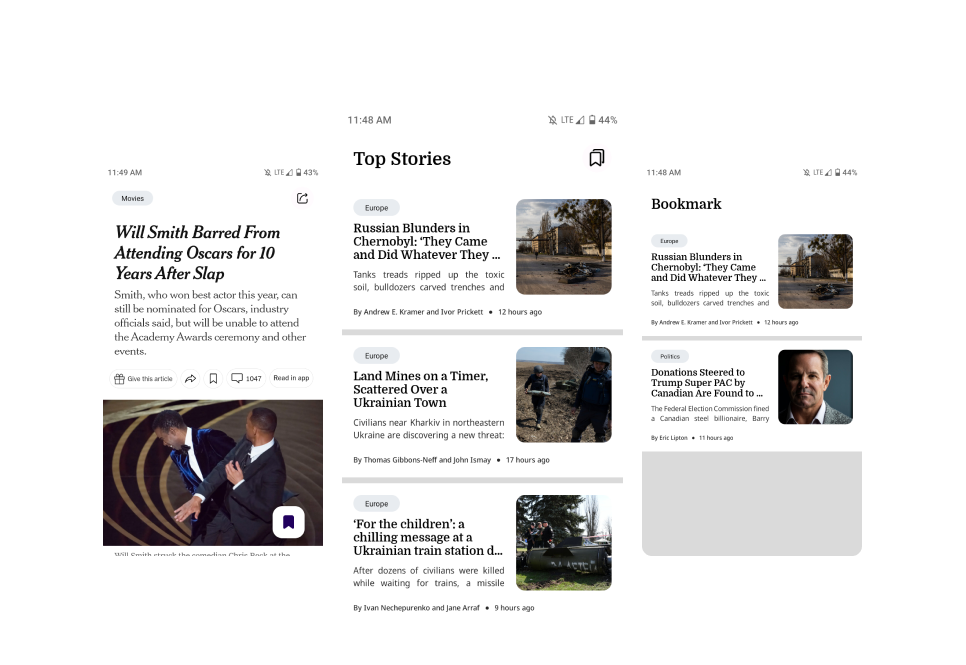

<h1 align="center">NY Times</h1>

<p align="center">  
Simple sample news app NY Times
</p>

<p align="center">
  <a href="https://opensource.org/licenses/Apache-2.0"></a>
  <a href="https://android-arsenal.com/api?level=21"></a>
</p>

<p align="center">

</p>

## Download
Go to the [Releases](https://github.com/arrazyfathan/NewYorkTimes-App/releases/download/v1.0/nytimes-release.apk) to download the latest APK.

## Tech stack & Open-source libraries
- Minimum SDK level 21
- [Kotlin](https://kotlinlang.org/) based, [Coroutines](https://github.com/Kotlin/kotlinx.coroutines)
- Jetpack
    - Lifecycle - dispose of observing data when lifecycle state changes.
    - ViewModel - UI related data holder, lifecycle aware.
    - Room Persistence - construct the database using the abstract layer.
- Architecture
    - MVVM Architecture
    - Repository pattern
- [Material-Components](https://github.com/material-components/material-components-android) - Material design components for building ripple animation, and CardView.
- [Glide](https://github.com/bumptech/glide) - Load image and caching image
- [TimeAgo](https://github.com/marlonlom/timeago) - Simple java library for displaying dates as relative time ago language.
- [Lottie](https://github.com/airbnb/lottie-android) - Render After Effects animations natively on Android and iOS, Web, and React Native
- [Swiperefreshlayout](https://developer.android.com/jetpack/androidx/releases/swiperefreshlayout?hl=id) - Implement the swipe-to-refresh UI pattern.
## API by [NY Time API](https://developer.nytimes.com/get-started/)
```
https://new-kbbi-api.herokuapp.com
``` 

## Demo App

# License
```xml
Designed and developed by 2022 arrazyfathan (Ar Razy Fathan Rabbani)

Licensed under the Apache License, Version 2.0 (the "License");
you may not use this file except in compliance with the License.
You may obtain a copy of the License at

   http://www.apache.org/licenses/LICENSE-2.0

Unless required by applicable law or agreed to in writing, software
distributed under the License is distributed on an "AS IS" BASIS,
WITHOUT WARRANTIES OR CONDITIONS OF ANY KIND, either express or implied.
See the License for the specific language governing permissions and
limitations under the License.
```